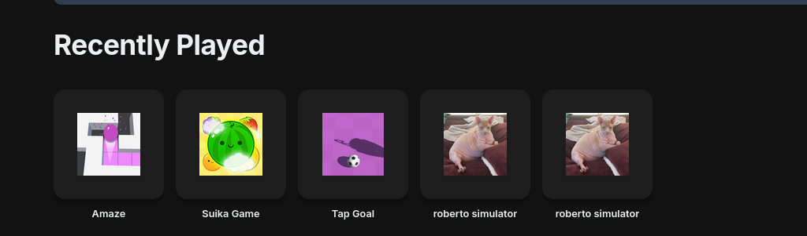

# games.jsx

#### Loading games from API

Once games are added to the API, we load from the JSON API file. This is done with:

```javascript
useEffect(() => {
  fetch("/api/games.json")
    .then((r) => r.json())
    .then((data) => {
      setGames(data.games || []);
      setFilteredGames(data.games || []);
      setLoading(false);
    })
    .catch((err) => {
      console.error("Error loading games:", err);
      setLoading(false);
    });
```

If you want to keep the API somewhere else, you can adjust the following line:

```javascript
fetch("/path/to/your/json/file")
```

#### Loading "Recently Played"

Recently Played is a bar that appears underneath the search bar.

<figure><figcaption></figcaption></figure>

This is kept in localstorage (constant).

```javascript
const savedRecent = localStorage.getItem("scg_recent");
if (savedRecent) {
  setRecentGames(JSON.parse(savedRecent));
}
```

&#x20;We track the recently played with handleGameClick.

```javascript
const handleGameClick = async (game) => {
  console.log("[Debug] handleGameClick triggered for:", game?.title);
  // Privacy-friendly analytics - we await it with a small timeout to prevent NS_BINDING_ABORTED
  try {
    console.log("[Debug] Calling trackGamePlay...");
    await Promise.race([
      trackGamePlay(game),
      new Promise((resolve) => setTimeout(resolve, 300)), // Max wait 300ms
    ]);
    console.log("[Debug] trackGamePlay finished or timed out");
  } catch (e) {
    console.warn("[Analytics] Tracking timed out or failed", e);
  }
```

We don't explicitly check for timeouts.

newRecent is then updated with the new recent.

```javascript
  const newRecent = [
    game,
    ...recentGames.filter((g) => g.url !== game.url),
  ].slice(0, 10);
  console.log("[Debug] Updating recent games...");
  setRecentGames(newRecent);
  localStorage.setItem("scg_recent", JSON.stringify(newRecent));

  console.log("[Debug] Navigating to:", game.url);
  // Check if URL is external (starts with http:// or https://)
  if (game.url.startsWith("http://") || game.url.startsWith("https://")) {
    window.open(game.url, "_blank", "noopener,noreferrer");
  } else {
    window.location.href = game.url;
  }
};
```

#### JSX load point

JSX is returned at line 259.&#x20;
