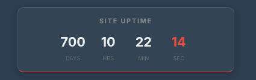

# Happy 700 days of service!

Space Cat Games has offically been in service for 700 days/100 weeks! It's weird to think that 600 days ago, I added a tip that said "100 days in service!"

As we are approaching 2 years of service, some changes will be made. Development has slowed down recently, and I'm planning to fix that. I'm looking to partner with UGS and a few other people to improve the game count on the site.

If you're interested, 700 days is equal to:

16,800 hours.
1,008,000 minutes.
60,480,000 seconds.
And 1.2k commits.

See you at the next 800 day service post!
